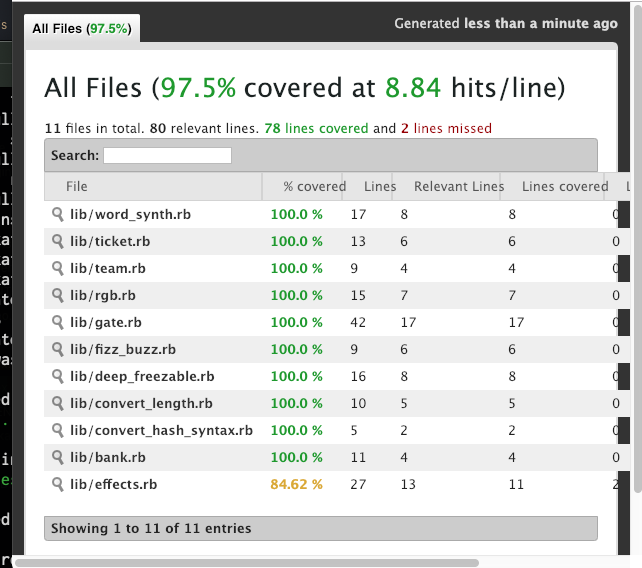

<div style="text-align:center;font-size: 3em;">
  Let's Rspec
</div>
<div style="text-align:right;font-size: 0.7em;">
   2019-01-16<br>
      加藤洋一
</div>

---

# 目的

- 実装変更したら、rspec で確認してから PR をつくるのが習慣になるようにしたい。
<br/>
  -  他人が書いた rspec ファイルコードを読めるようになる。
  - Rspec を効率的に利用できるようになる。

---

10 分間の話を聞いただけできるハズはない！
<br><br>
ここでは その学習のきっかけが作れれば良い。
<br/>

  - １人で勉強するのが苦なら勉強会を開催する？)

---

## 教材

- https://qiita.com/jnchito/items/60ea1389d00e72b729e7
「プロを目指す人のためのRuby入門」のテストコードを、筆者自らRSpecに書き換えてみます。

github: https://github.com/JunichiIto/ruby-book-codes/tree/rspec/ruby-book

youtube: https://www.youtube.com/watch?v=BmPD2KIZ5eY&feature=youtu.be   (30分)

---

## 自習実施例

「プロを目指す人のためのRuby入門」の rspec を書き直してみている。(in progress)

https://github.com/katoy/ruby-book-codes/tree/study

---

## これがわかれば読書きできる!

- describe / context / example / it<br/>
  xを頭につけると pnding にできる
- expect
- subject / is_expected
- change.by / change.from.to / .and で結合可能
- let
- before / after / around

---

- receive(...).with(...).and_return
  - expect(Rails.logger).to receive(:info).with(xxx)
    で logger 出力をチェックできる。
  - csv 入力内容を ファイルを作らずに読込んだ動作ができる。
- output<br/>
  stdout, stderr への出力をチェックできる。
- double / stub<br/>
  DB アクセス, 外部 API アクセスをダミーにできる

---

- shared_context / include_context
- shared_example / it_behaves_like
- aggregate_failures
- raise_error message

---

## 最近のテスト作業上のネタ

- rake のタスク全体にある処理を数せていたが、引数指定に対応していなくて 引数指定した際に動作していなかった。
- eagerload 設定が develop / production で違っていて、rake task 動作に差がでていた。

---

- hash から いくつかの key を削除する際に "key" と :key の指定を混同していて、hash から情報削除できてなかった。

- rapec でのテストを追加したら Fail した。
調べると x年前の更新 PR 説明では rspec が pass することになっていたが,その変更部は通過していなかった。
あるいは、rspec が全くそのクラスについては作成されていなかった。

---

## テストの種類

- モデルスペック
- コントローラスペック
- システムスペック
- 結合テスト
- リクエストスペック
- ルーティングテスト
<br/>
- サーバースペック (サーバ状態のテストツール)

---

## 関連ツール

  - coverage

    ```
    $ rspec
    $ open coverage/index.html
    ```

---



---

  - TimeHelper / TimeCop
   https://techracho.bpsinc.jp/penguin10/2018_12_25/67780
   Timecopを使わなくても時間を止められた話
> ...
> テストで時間を止めたい時、Timecopを使わないと止められないと思っていましたが、Rails4.1以降は標準のActiveSupport::Testing::TimeHelpersでも止められると最近知りました。
> ...

---

  - API Blueprint
  https://blog.mmmcorp.co.jp/blog/2018/01/18/api_blueprint_dredd/
  API Blueprintで書いたAPI仕様書をDreddを使ってCircleCIでテストしてみた
  <br/>
  - metric_fu
  <br/>静的コードチェック

---

  - gathling
  https://qiita.com/yasuaki0206/items/c84361faef08d6788fd0
    gatlingで負荷テストを行った
<br/>
  - OWASP Zed
  https://www.pupha.net/archives/1370/
    OWASP Zed Attack Proxy (ZAP)で脆弱性検査する方法

---

## 参考書籍/URL

  - https://railsguides.jp/testing.html#%E3%82%B7%E3%82%B9%E3%83%86%E3%83%A0%E3%83%86%E3%82%B9%E3%83%88
  Rails テスティングガイド
<br/>
  - https://www.amazon.co.jp/gp/product/B076VTMTV8
  Effective Testing with RSpec 3: Build Ruby Apps with Confidence (English Edition)

---

  - https://leanpub.com/everydayrailsrspec-jp
  Everyday Rails - RSpecによるRailsテスト入門
    - ソースコード https://github.com/everydayrails/everydayrails-rspec-2017

---

  - https://www.amazon.co.jp/dp/4274217884/
  テスト駆動開発 新訳版 (2017/10/14)
> ...
> テストは品質をあげない - 質をあげるのはプログラミング
> ...
> テストを書いても設計を改善しないのであれば、それはただの回帰テストであり、現状の追従でしかありません。
> ...

---
